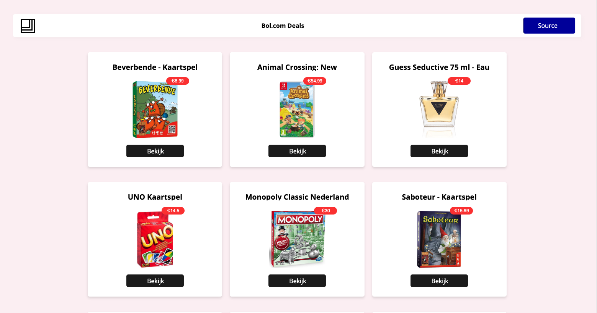

# Bol.com Deals

<table style="margin-left: auto; margin-right: auto;">
    <tr>
        <td align="center"><a href="#-live-demo">💻 Live demo<a></td>
        <td align="center"><a href="#-Description">📓 Description<a></td>
        <td align="center"><a href="#-Installation">🤖 Installation<a></td>
        <td align="center"><a href="#-Dependencies">🤝 Dependencies<a></td>
    </tr>
</table>

## 📓 Description
Bol.com Deals is a website that finds, and provides deals from [bol.com](https://www.bol.com/). 

## 💻 Live demo
[Link](https://bol-com-git-master.sjagoori.vercel.app/)

## 🤖 Installation
**Run the project:**
1. Install dependencies
`npm install`
2. Run project
`npm run dev`

## 🤝 Dependencies
[React](https://github.com/facebook/react)  
[NextJS](https://nextjs.org/)   
[Styled-components](https://styled-components.com/)   
[@material-ui/core](https://material-ui.com/)
