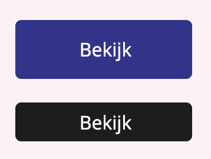

# Button component

## Table of contents
  - [What it does](#what-it-does)
  - [How to use](#how-to-use)
  - [Dependencies](#dependencies)
  - [Developer](#developer)
  - [Changelog](#changelog)

<div style="text-align:center"></div>

## What it does 
* Generate a button

## How to use
Import and implement component
```js
import Button from '../button/Button'

<Button
  label='label'             // required
  url='#'                   // required
  productid={this.props.id} // optional
  type='secondary'          // required
/>
```

## Dependencies
* [NextJS](https://nextjs.org/)
* [Styled-components](https://styled-components.com/)
* A theme file in styling/theme.js

## Developer
[Shabier](https://www.github.com/sjagoori)

## Changelog
### 1.2
* Added support for secondary buttons

### 1.1
* Initial creation