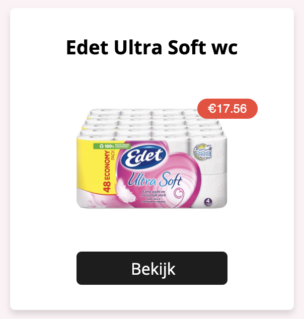

# Product component

## Table of contents
  - [What it does](#what-it-does)
  - [How to use](#how-to-use)
  - [Dependencies](#dependencies)
  - [Developer](#developer)
  - [Changelog](#changelog)

<div style="text-align:center"></div>

## What it does 
* Generate a product-card

## How to use
Import and implement component

```js
import Product from '../components/product-card/Product'

<Product
  id='id'                     //required
  title='title'               //required
  img='/images/picture.png'   //required
  price='15,00'               //required
/>
```

## Dependencies
* [NextJS](https://nextjs.org/)
* [Styled-components](https://styled-components.com/)
* [@material-ui/core](https://material-ui.com/)
* Button component
* A theme file in styling/theme.js

## Developer
[Shabier](https://www.github.com/sjagoori)

## Changelog
### 1.2
* Added badges for pricing

### 1.1
* Initial creation